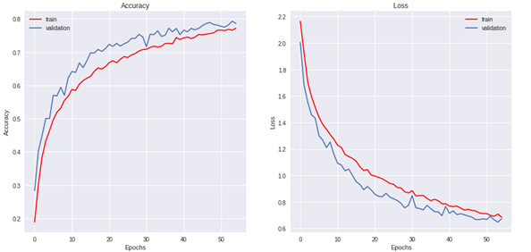
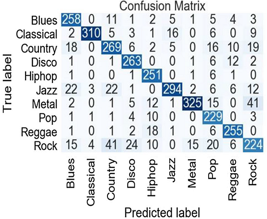

# Music Genre Classification with Convolutional Neural Networks

## Abstract
Since 2002, music genre classification system has beenintroduced as a pattern recognition task. So far, numerous researches and studies have been conducted to increase
the accuracy and reduce the complexity in this field. In this project we designed a model which takes the spectogram of music pieces as an input and analyzes the image using a Convolutional Neural Network (CNN). The output of the system is a vector of predicted genres for the song.  

## Chunks
To train our model, we used the GTZAN database. First, we chunked each 30-second music piece into smaller three-second music clips with a 50% overlap.

)


## Feature Extraction (Mel spectrogram)
Actually, the Mel-spectrogram is the Mel-scaled spectrogram.
Mel-Spectrogram represents an acoustic time–frequency representation of a sound: the power spectral density P (f, t). It is sampled into a number of points around equally spaced times
ti and frequencies fj(on a Mel frequency scale). The Mel frequency scale is defined as:


And its inverse is:


```bash

```
## Model

The system contains 14 layers including the input layer and dense fully connected layers. The inputs are the acoustic features that are extracted from the audio signal.
In our experiment, we applied dropout regularization after every pooling layer to avoid over-fitting and feature co-adaptation. Rectified linear unit (ReLUs) are used as the activation function in all convolutional and
dense layers.

 

## Validation

We have used the GTZAN database to train the model. For neural network training, 80% of GTZAN database was used for training (12000 samples for training) and the rest 20% (3200 samples) were used for neural network testing and validating.

 

## Confustion Matrix (Result)
For showing the result we have used confusion matrix.

 


## Install requirements

```bash
pip install -r .\requirements.txt
```
